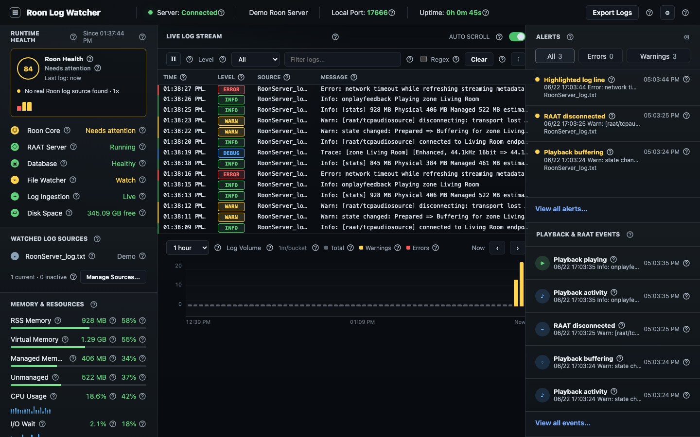
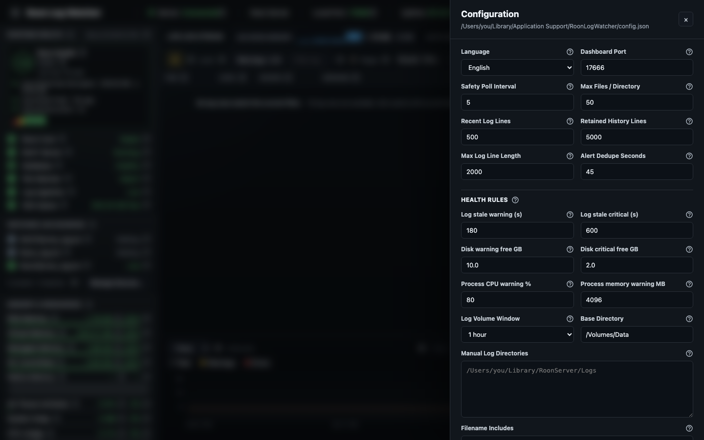
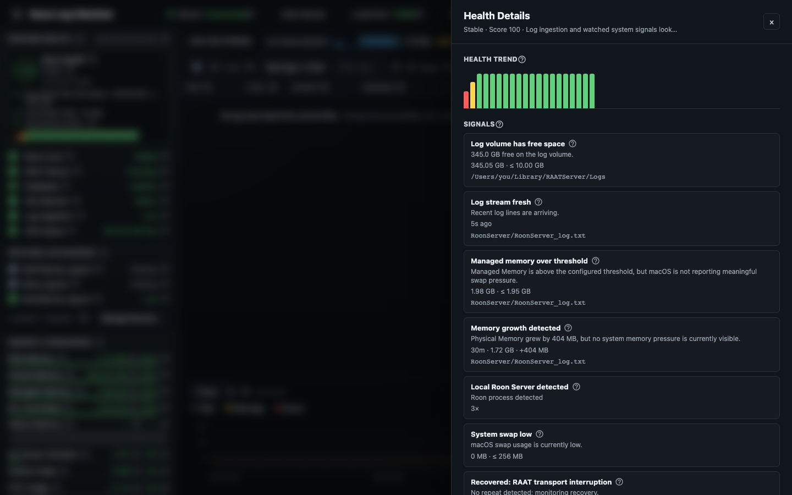

# Roon Log Watcher for macOS

This Swift/macOS version is based on the original [`stefanmauron/roon-log-watcher`](https://github.com/stefanmauron/roon-log-watcher) GitHub project.

Roon Log Watcher is a native macOS menu bar app for watching local Roon,
Roon Server, RAAT Server, Roon Appliance and Roon Bridge log files. It exposes a
browser-based dashboard at `http://127.0.0.1:17666`, keeps a bounded in-memory log
history, groups related messages into diagnostic incidents, highlights relevant
events and calculates a weighted Roon Health score. Adaptive baselines and
explainable predictions help distinguish normal Roon activity from developing
resource or reliability problems.
The dashboard can also be opened from another system on the same network by
using the Roon Mac's hostname or IP address with the configured dashboard port,
provided macOS firewall and network settings allow the connection.

The app can run against real local Roon logs or, when no logs are found, a demo
feed. Direct Roon Server API access is not required.

## Screenshots

### Dashboard



### Configuration



### Roon Health Details



## Dashboard Workflow

The dashboard is designed for both local use on the Roon Mac and remote use from
another browser on the same network. The right sidebar keeps the most important
operational lists close to the live stream:

- **Alerts** shows deduplicated warnings and critical log events. The default
  live-stream level filter is `Warnings + Critical`, so routine informational
  lines do not hide relevant problems.
- **Memory Insights** lists detected Roon memory jumps from the last seven days
  and keeps related log context available below each insight.
- **Diagnostics & Predictions** groups related Roon messages into operational
  incidents, shows active, monitoring and recovered states, and reports trends
  that differ meaningfully from the learned local baseline.
- **Playback & RAAT Events** is scoped to playback and RAAT activity only. Its
  full view does not include unrelated system, memory or generic highlighted log
  timeline entries.

The sidebar footer actions open structured dashboard panels instead of raw JSON:

| Action | Opens | Useful controls |
| --- | --- | --- |
| View all alerts | Full alert list | Search, severity filter, full message text |
| View all diagnostic incidents | Seven-day incident history | Search, severity filter, state, recovery and correlated evidence |
| View week of memory insights | Seven-day memory insight list | Search, deltas, confidence, related log lines |
| View all Playback & RAAT events | Full playback/RAAT event list | Search, severity filter, source/type/zone chips |

Expanded related-log sections stay open while the live dashboard refreshes, so a
memory insight or warning can be inspected without pausing the live stream first.
Live refreshes request only log lines newer than the browser's current snapshot.
The complete alert, diagnostic-incident, memory-insight and playback collections
are loaded only when their full views or the diagnosis export are opened.

## What Gets Monitored

The watcher combines log-derived events with local system signals:

- Log files from common Roon locations under `~/Library`, `/Users/Shared`,
  `/Library`, and the configured `baseDirectory`.
- Optional manual log directories and environment based paths:
  `ROON_LOG_DIR`, `ROONSERVER_LOG_DIR`, and `ROONSERVER_DATAROOT`.
- Current, non-rotated log files matching `fileNameIncludes`, while rotated
  archives and AppleDouble metadata files such as `._Package.swift` are ignored
  by the live tailer.
- New log lines only; the tailer reads append-only changes in bounded chunks,
  retains incomplete UTF-8 lines until their newline arrives and detects file
  replacement or truncation without loading an entire backlog at once.
- Roon runtime statistics: physical and virtual memory, GC-committed and
  managed-live memory, native memory, managed utilization and GC pause duration
  and window percentage, plus a compact 24-hour Roon memory trend in the
  live-log header.
- Automatic memory-jump analysis: large physical, managed or unmanaged memory
  changes are correlated with nearby Roon log activity and retained for seven
  days.
- Playback activity and instability: playing, stopped, buffering, timeout,
  failed, dropped and network error style lines.
- RAAT activity: connect, reconnect, disconnect, transport lost and device lost.
- Roon file-cache status and image fetch retry/failure lines.
- Server lifecycle and failure indicators: startup, shutdown, fatal, crash,
  panic, unhandled exception, out-of-memory and segmentation fault.
- Database signals: corruption, malformed SQLite image, locked database,
  SQLite busy, slow query, timeout, rollback and maintenance completion.
- Operational episodes: database maintenance, server lifecycle, RAAT transport,
  playback failure, extension/API connectivity and sync, remote access and cast
  authentication. Related lines are correlated by time and endpoint instead of
  being counted as unrelated failures.
- Local host status: likely Roon host detection, matching Roon processes, CPU,
  resident memory, system swap usage, Roon Disk I/O, optional open-file counts
  and log-volume free space. Values macOS does not expose are shown as `--`;
  synthetic placeholder values are avoided.
- Dashboard state: retained recent logs, exportable log history, deduplicated
  alerts, playback/RAAT timeline, log-volume buckets, health trend samples and
  24-hour memory trend samples, plus seven days of memory-jump insights.

## Memory Jump Analysis

The dashboard includes a **Memory Insights** section for larger Roon memory
changes. When a new Roon stats sample arrives, the app compares it with the
previous sample. A new insight is created when one of these default thresholds is
crossed:

| Metric | Default jump threshold |
| --- | ---: |
| Physical memory | 150 MB |
| Managed memory | 250 MB |
| Native memory (legacy unmanaged metric) | 250 MB |

For each detected jump, the app looks at nearby non-stats Roon log lines in a
two-minute window before and after the sample. It classifies the surrounding
activity into categories such as startup/warm-up, metadata update, library work,
streaming-service sync, cache/image work, playback/RAAT, database or
network/API activity. The dashboard then shows the memory delta, confidence,
sample window and the most relevant related log lines.

These insights are correlation hints, not proof of root cause. Roon logs usually
do not state exactly which internal task allocated or released memory, but the
nearby log context is often good enough to explain whether a jump happened during
metadata work, startup cache loading, streaming sync, playback activity or other
visible work. Insights are persisted in the app configuration folder as
`memory-insights.json` and pruned after seven days.

## Diagnostics and Predictions

The diagnostic engine turns bursts of related log lines into a single incident.
For example, RAAT disconnects caused by a database-maintenance or server-restart
episode stay attached to that parent incident instead of producing several
independent Health penalties. Incidents progress through `active`, `monitoring`
or `resolved` states and retain a compact set of relevant, redacted log evidence
for seven days.

Explicit success messages such as server start, RAAT reconnect, playback resume,
database recovery, extension reconnect and restored remote connectivity close the
corresponding incident immediately. When Roon does not emit a recovery line, a
domain-specific quiet period moves the incident through monitoring and recovery.
This lets the current Health state recover without deleting the historical
explanation.

The app learns adaptive local baselines for Roon physical/process memory, CPU,
open files, disk throughput and GC pause activity. Compact five-minute samples
and baseline state are persisted, so learning continues across app restarts
without retaining raw logs. The current predictions cover:

- physical memory that keeps rising without returning to baseline;
- sustained GC pause pressure or CPU load;
- open-file growth and sustained disk activity;
- recurring endpoint-specific incidents within 24 hours.

Each prediction includes its confidence, observation window, current and baseline
values, trend where applicable and the evidence used for the conclusion. A
prediction is a warning sign, not a claim that a failure is certain.

## Roon Health Score

Roon Health starts at `100`. Each active health signal contributes an impact
value. Signals belonging to the same correlated incident are combined using only
their strongest impact. Memory threshold, growth, GC and system-pressure signals
are likewise capped as one memory-pressure group. The effective total is capped
at `100`, then subtracted:

```text
score = max(0, 100 - min(100, sum(grouped effective impacts)))
```

The state is derived from both score and severity:

- `Healthy`: no warning/critical signals and score is at least `82`.
- `Degraded`: warning signals exist, or the score falls below `82`.
- `Critical`: any critical signal exists, or the score falls below `55`.
- `Unknown`: no useful log/source evidence is available yet.

Signals are sorted by severity first, then by impact and recency. The dashboard
shows the strongest current signals, while the Health Details panel includes the
trend, local system state and watched-source state.

Default signal weights:

| Area | Condition | Default impact |
| --- | --- | ---: |
| Sources | no watched source | 28 |
| Sources | only demo data | 16 |
| Sources | only inactive/non-current logs | 20 |
| Logs | no line processed yet | 24 |
| Logs | stream stale warning / critical | 16 / 34 |
| Events | critical log events in the event window | up to 42 |
| Events | warning burst in the event window | up to 28 |
| Server | fatal crash, panic, unhandled exception, OOM | 42 |
| Server | latest server state stopped | 40 |
| Server | retryable or generic exception warnings | up to 18 |
| Database | corruption or malformed SQLite database | up to 42 |
| Database | locked/busy/slow/failed database activity | up to 24 |
| RAAT | visible transport interruption burst warning / critical | 18 / 34 |
| RAAT | latest state disconnected | 12 |
| Playback | timeout/failure warning burst | up to 24 |
| Playback | heavy repeated playback instability | up to 32 |
| Diagnostics | active correlated incident | strongest domain impact only |
| Predictions | explainable warning-level developing trend | up to 14 |
| Memory | near threshold at 92% / over threshold without macOS pressure | 0 |
| Memory | near threshold with swap pressure | 8 |
| Memory | over threshold with swap pressure or high system share | 12 / 28 |
| Memory | growth over the configured window without pressure / with pressure | 0 / 14 |
| System | high Roon process CPU | 14 |
| System | high Roon process memory without pressure / with pressure | 0 / 14 |
| System | active macOS swap-out warning / critical | 24 / 42 |
| Disk | low / critical free log-volume space | 14 / 34 |

The important detail is that not every Roon `Error` text is treated as equally
dangerous. A plain playback buffering line, image fetch retry, transient SQLite
busy message or a track title containing words such as `Crash` should not
collapse the score to zero. Memory is also weighted against real macOS pressure:
high Roon memory alone is treated as an observation when no active swap-out
pressure is visible and the system still has headroom.

Resolved incidents contribute a recovery signal with zero impact and suppress
stale raw warnings from the same episode. Known maintenance can also suppress
secondary RAAT, playback or database noise while the maintenance incident itself
remains visible. This keeps one real episode from being counted several times.

Swap activity is the strongest memory-pressure signal. Allocated swap by itself
is informational because macOS can keep it allocated after pressure has ended.
New swap-outs become warning-level at about `0.05 MB/s` and critical at about
`5 MB/s`. Roon process memory also becomes health-relevant when it represents a
very high share of physical RAM.

## Log Message Weighting

The parser first tries to classify a line into a known domain. Domain-specific
classification wins over plain text severity:

- `info`: memory samples, file-cache status, normal playback activity, RAAT
  reconnect/connect events, plain buffering, database maintenance and image
  fetch retries that still have attempts left. Known operational messages such as
  successful ML Radio status, missing optional waveform data, completed backup
  cleanup and routine AirPlay disconnects also remain informational.
- `warning`: playback timeout, failed, dropped or network-error lines; RAAT
  transport lost, device lost or disconnected lines; server stopped; retryable or
  generic exceptions; SQLite busy, locked database, slow query, timeout, rollback
  and exhausted image fetch retries.
- `critical`: fatal, crash, panic, unhandled/uncaught exception, out-of-memory,
  segmentation fault, database corruption and malformed SQLite database image.

If a line is interesting but does not match a domain parser, it becomes a
highlighted log event. Fallback weighting uses conservative keywords:
explicit fatal errors, Roon/server crash markers and corruption become critical;
`warning`, `timeout`, `failed` and `disconnect` become warning; other highlighted
lines remain informational. Ordinary metadata containing words such as `Crash`
or `Panic` is not sufficient for a server-failure classification.

The health evaluator then applies windowed thresholds. Plain buffering and normal
RAAT reconnect activity stay informational. Playback timeout/failure warnings are
warning-level by default and become critical only after a much larger repeated
burst. RAAT transport interruptions use warning and critical disconnect counts.
Database corruption is immediately critical, while SQLite busy/locked activity is
warning-level and capped.

Critical server exceptions affect Health only inside the configured event window.
They remain available in the alert history but no longer keep the current Health
state critical indefinitely.

Playback status lines are parsed before generic server-error fallbacks. This
prevents normal track metadata such as a song title containing `Crash` from being
mistaken for a Roon server crash.

## Configuration

The app creates its configuration at:

```text
~/Library/Application Support/RoonLogWatcher/config.json
```

You can open or reveal that file from the menu bar item, or edit the most common
settings from the browser dashboard using the gear button.

Currently active settings:

- `language` (`de` or `en`)
- `dashboardPort`
- `pollIntervalSeconds` (5-30 second safety poll; normal log updates are event-driven)
- `baseDirectory`
- `autoDiscoverRoonLogDirectories`
- `logDirectories`
- `fileNameIncludes`
- `maxFilesPerDirectory`
- `enableDemoModeWhenNoLogs`
- `watchExistingLogsFromEnd`
- `recentLogMaxLines`
- `logHistoryMaxLines`
- `maxLogLineCharacters`
- `alertDedupeSeconds`
- `logVolumeWindowMinutes` (`15`, `60`, `180` or `360`)
- `memoryAlerts`
- `healthRules`
- `sendMacNotifications`
- `showAllLogLines`

Saved settings are applied to the running store and watcher immediately, except
for `dashboardPort`, which still requires an app restart. When `showAllLogLines`
is disabled, ordinary lines still update source freshness but only lines producing
parser events are retained in the live/history views.

The main health-rule defaults are:

- log stale warning / critical: `180s` / `600s`
- warning burst window/count: `15 min` / `5`
- RAAT disconnect window, warning count, critical count: `15 min`, `2`, `5`
- database window: `30 min`
- playback window / critical base count: `15 min` / `5`
- disk warning / critical free space: `10 GB` / `2 GB`
- disk warning / critical free ratio: `5%` / `2%`
- process CPU warning: `80%`
- process memory warning: `4096 MB`
- health trend sample interval: `30s`
- memory thresholds: physical `2500 MB`, managed `2000 MB`, unmanaged `1800 MB`
- memory near-threshold warning: `92%` of the configured metric threshold
- memory growth window / threshold: `30 min` / `200 MB`

## Run

```bash
./script/build_and_run.sh
```

## Test

```bash
swift test
```

## Changelog

### [v0.2.0](https://github.com/mermayer/RoonLogWatcher_Swifted/releases/tag/v0.2.0) - Diagnostics, Predictions and Runtime Efficiency - 2026-07-10

- Reworked live log tailing with bounded chunk reads, UTF-8-safe partial-line
  buffering, oversized-line protection, rotation/truncation detection and
  event-driven file notifications with a low-frequency safety poll.
- Replaced shifting bounded arrays with ring buffers, removed the duplicate live
  log buffer and reduced per-line file metadata work.
- Reduced the in-memory memory-analysis context from seven days to a compact
  ten-minute raw-line window. Completed memory insights remain available for the
  full seven-day analysis period, while classification is deferred until a jump
  actually occurs.
- Added incremental log-volume buckets plus cached Health and 24-hour memory
  trend calculations to avoid repeatedly scanning and sorting complete histories.
- Replaced recurring `pgrep`, `ps` and `sysctl` helper processes with direct
  macOS process and swap APIs; delayed and compacted memory-insight persistence.
- Applied saved configuration and retention changes immediately; implemented the
  previously inactive `showAllLogLines` option.
- Reduced dashboard refresh traffic with compact snapshots, incremental log
  deltas and on-demand full collections for alerts, memory insights and playback;
  closed collection views now release their downloaded rows and rendered DOM.
- Changed memory pressure scoring so allocated swap is informational unless new
  swap-outs show active pressure; Swap-out rates are visible in Health Details.
- Limited critical server exceptions to the configured event window, returned
  every signal used by the Health score and tightened fatal keyword parsing.
- Added nearest-year timestamp handling, reliable asynchronous port fallback and
  overflow-safe port candidates.
- Added a persistent incident engine that correlates related database, server,
  RAAT, playback, extension/API, remote-access and device messages instead of
  treating each log line as a separate problem.
- Added explicit recovery detection, quiet-period recovery and incident-level
  Health caps so secondary messages from one episode cannot multiply the score
  penalty.
- Parsed current Roon GC-committed, managed-live, native and GC-pause statistics
  and exposed them in the resource panel and diagnostic snapshots.
- Improved memory-jump attribution with before/after timing, large API payload
  weighting, maintenance/extension/remote categories and redacted byte-counted
  evidence.
- Added persisted adaptive baselines and explainable predictions for slow memory
  growth, GC pressure, sustained CPU/disk load, open-file growth and recurring
  incidents.
- Added the **Diagnostics & Predictions** sidebar and a searchable seven-day
  incident collection with state, recovery and expandable evidence.
- Made the left runtime, source and resource rail substantially more compact so
  all rows fit in a typical desktop-height window, with independent scrolling as
  a fallback for smaller browser windows.
- Expanded regression coverage to 66 tests and removed strict Swift concurrency
  warnings.

### [v0.1.4](https://github.com/mermayer/RoonLogWatcher_Swifted/releases/tag/v0.1.4) - Smarter Memory Pressure and Disk I/O - 2026-06-30

- Reworked memory health evaluation so high Roon memory alone is informational
  when macOS swap pressure is low and the system still has headroom.
- Added macOS swap sampling to Health Details and the resource panel; significant
  swap usage now drives the strongest memory-related Health warnings.
- Replaced the placeholder I/O wait row with real **Roon Disk I/O** throughput
  derived from macOS per-process resource counters.
- Added per-process read/write Disk I/O rates to local system snapshots and
  Health Details.
- Fixed playback status parsing so track titles such as `Crash` are not
  misclassified as Roon server crashes.
- Improved alert-detail layout in the right sidebar so long warning/error text
  stays readable without covering the list.
- Added tests for smarter memory pressure scoring, swap escalation, Roon Disk I/O
  sampling and playback-title crash classification.

### [v0.1.3](https://github.com/mermayer/RoonLogWatcher_Swifted/releases/tag/v0.1.3) - Memory Insights and Dashboard Views - 2026-06-28

- Added the **Memory Insights** section with seven-day persistent memory-jump
  analysis, confidence values, sample windows and related Roon log context.
- Replaced raw `/api/snapshot` sidebar links with structured dashboard panels
  for alerts, weekly memory insights and Playback & RAAT events.
- Scoped the Playback & RAAT full view to playback/RAAT events only, excluding
  unrelated system, memory and generic timeline entries.
- Preserved expanded related-log sections across live dashboard refreshes.
- Improved the live-log toolbar with a graphical pause/resume button, removed
  the unused three-dot button and tightened the center/right layout.
- Extended the 24-hour Roon memory trend and improved memory/resource handling,
  including open-file sampling behavior on macOS.
- Further reduced health-score noise by weighting transient Roon playback, RAAT
  and database messages more conservatively.

### [v0.1.2](https://github.com/mermayer/RoonLogWatcher_Swifted/releases/tag/v0.1.2) - System Resource Sampling Fixes - 2026-06-25

- Fixed local Roon process detection on macOS for RAATServer, RoonServer and
  RoonAppliance.
- Fixed CPU and Roon process memory reporting in Health Details and the resource
  panel.
- Added valid open-file descriptor sampling via macOS process APIs with an
  `lsof` fallback.
- Removed hard-coded placeholder values for CPU, I/O wait and open files.
  Unavailable I/O wait now shows `--`.
- Extended 24-hour Roon memory trend retention so dense stats lines no longer
  collapse the visible history to only a few hours.
- Updated README and dashboard help text for optional or unavailable macOS
  resource values.

### [v0.1.1](https://github.com/mermayer/RoonLogWatcher_Swifted/releases/tag/v0.1.1) - Dashboard and Health Refinements - 2026-06-23

- Added documentation for remote dashboard access from other systems on the same
  network.
- Added the MIT license and expanded README coverage for monitored resources,
  Roon Health scoring, weighted log classification and screenshots.
- Added and widened the 24-hour Roon memory trend in the live-log header.
- Changed the default live-log level filter to `Warnings + Critical` and added
  the combined filter option.
- Improved alert retention and detail handling for warning and critical entries.
- Excluded rotated log archives from live tailing by default and cleaned up old
  watched-source state.
- Reduced health-score impact from isolated playback buffering, timeout and RAAT
  reconnect activity.
- Lowered severity for common non-critical Roon operational messages and refined
  memory threshold handling.
- Reduced dashboard snapshot size and verified lower runtime CPU and memory use.

### [v0.1.0](https://github.com/mermayer/RoonLogWatcher_Swifted/releases/tag/v0.1.0) - Initial macOS Release - 2026-06-23

- Initial Swift/macOS release based on the original
  [`stefanmauron/roon-log-watcher`](https://github.com/stefanmauron/roon-log-watcher)
  project.
- Added a native macOS menu bar app with a browser dashboard for local or remote
  monitoring on the configured dashboard port.
- Added automatic and manual Roon log source discovery.
- Added live log stream filtering, severity highlighting and log export.
- Added weighted Roon Health scoring across log, playback, RAAT, database,
  memory, process and disk signals.
- Added Roon Health details, dashboard configuration and demo mode.
- Added bounded in-memory log/history handling to keep resource use controlled.
